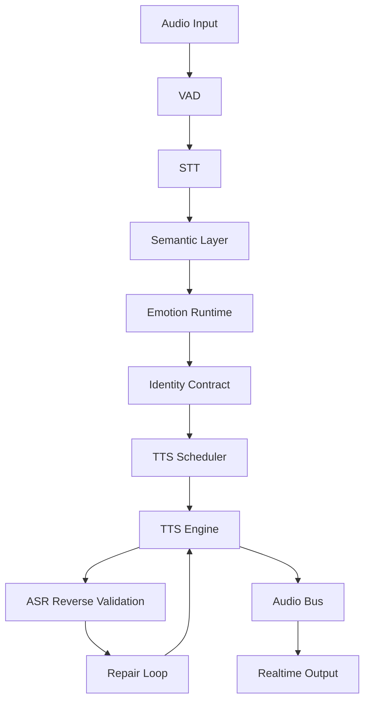

# yt4

## Purpose

`resonance` is an autonomous emotional voice runtime system.

It is designed to:

* preserve emotional continuity
* preserve identity continuity
* maintain semantic fidelity
* support realtime voice interaction
* execute autonomous long-running operation

The system treats:

* voice
* silence
* pacing
* atmosphere
* emotional state
* semantic preservation

as first-class runtime primitives.

---

# Core Philosophy

## Emotional Runtime Over Chatbot

The system is NOT:

* chatbot infrastructure
* generic TTS wrapper
* VTuber frontend
* single-shot media generator

The system IS:

```text id="jlwm3h"
persistent emotional identity runtime
```

---

# Architectural Principles

## 1. Autonomous Runtime

The system is designed for:

* persistent execution
* unattended operation
* crash recovery
* autonomous reruns
* self-healing workflows

Inspired by:

* Crash-Driven Development
* harness-oriented operation
* deterministic reruns

---

## 2. Semantic Integrity

Generated speech MUST preserve:

* meaning
* pacing
* emotional intent
* atmosphere

TTS output is never trusted directly.

Every generated artifact must support reverse validation.

---

## 3. Emotional Continuity

The system optimizes for:

```text id="2jlwmf"
録音されてしまった深夜
```

Meaning:

* emotional environmental continuity
* persistent atmosphere
* long-session emotional coherence

---

## 4. Identity Persistence

Identity is treated as a contract.

Voice generation must preserve:

* emotional tone
* pacing
* hesitation patterns
* softness
* speech rhythm
* breathing style

across reruns and long sessions.

---

# High-Level Architecture



---

# Core Layers

# 1. Runtime Layer

Responsible for:

* orchestration
* lifecycle management
* retries
* crash recovery
* state persistence

Structure:

```text id="jlwm74"
runtime/
  orchestrator/
  supervisor/
  scheduler/
  recovery/
  lifecycle/
```

---

# 2. Identity Layer

Responsible for:

* personality continuity
* pacing continuity
* emotional continuity
* anti-generic-AI enforcement

Structure:

```text id="rjlwm3"
identity/
  contracts/
  pacing/
  emotional-state/
  breathing/
  softness/
  anti-generic/
```

---

# 3. Emotional Runtime

Responsible for:

* emotional routing
* scene persistence
* silence modeling
* atmosphere continuity

Structure:

```text id="jlwmj9"
emotion/
  routing/
  scene-memory/
  atmosphere/
  silence/
  comfort/
```

---

# 4. Realtime Layer

Responsible for:

* low latency
* streaming
* interruption recovery
* duplex audio

Structure:

```text id="jlwmc0"
realtime/
  websocket/
  buffering/
  interruption/
  synchronization/
  transport/
```

---

# 5. Audio Pipeline

Responsible for:

* segmentation
* chunking
* normalization
* mixing
* rendering

Structure:

```text id="1jlwmq"
audio/
  segmentation/
  normalization/
  ffmpeg/
  rendering/
  mixing/
```

---

# 6. STT Layer

Responsible for:

* transcription
* reverse validation
* semantic verification

Engines:

* [Whisper](https://github.com/openai/whisper?utm_source=chatgpt.com)
* [faster-whisper](https://github.com/SYSTRAN/faster-whisper?utm_source=chatgpt.com)

Structure:

```text id="8jlwm1"
stt/
  streaming/
  reverse-validation/
  semantic-diff/
  damage-detection/
```

---

# 7. TTS Layer

Responsible for:

* synthesis
* emotion rendering
* breathing
* whisper generation

Engines:

* [Irodori-TTS](https://github.com/Aratako/Irodori-TTS?utm_source=chatgpt.com)
* [Fish Speech](https://github.com/fishaudio/fish-speech?utm_source=chatgpt.com)
* [CosyVoice](https://github.com/FunAudioLLM/CosyVoice?utm_source=chatgpt.com)

Structure:

```text id="jlwm9u"
tts/
  scheduler/
  providers/
  whisper/
  emotional/
  asmr/
```

---

# 8. Validation Layer

Responsible for:

* semantic integrity
* emotional drift detection
* pacing validation
* hallucination detection

Structure:

```text id="6jlwm0"
validation/
  semantic/
  emotional/
  pacing/
  continuity/
```

---

# 9. Harness Layer

Responsible for:

* evaluation
* benchmarking
* mutation loops
* reproducibility

Structure:

```text id="jlwmwe"
harness/
  latency/
  emotional/
  asmr/
  longform/
  realtime/
  consistency/
```

---

# Runtime States

```text id="jlwmx0"
IDLE
LISTENING
THINKING
SPEAKING
INTERRUPTED
RECOVERING
VALIDATING
REPAIRING
```

---

# Core Workflow

## Audio Production Workflow

```text id="jlwm2r"
script
↓
segmentation
↓
tts generation
↓
asr reverse validation
↓
semantic damage detection
↓
repair loop
↓
final rendering
↓
artifact persistence
```

---

# Realtime Workflow

```text id="jlwm5d"
mic input
↓
vad
↓
streaming stt
↓
emotion runtime
↓
identity enforcement
↓
tts scheduling
↓
stream synthesis
↓
reverse validation
↓
output stream
```

---

# Artifact Structure

```text id="9jlwmv"
runs/YYYY-MM-DD/project_id/
  script_master.md
  parts/
  asr_quality/
  metrics/
  prompts/
  final_mix.wav
  final_video.mp4
```

All reruns overwrite deterministic paths.

---

# Required Metrics

## Semantic

| Metric             | Purpose              |
| ------------------ | -------------------- |
| semantic drift     | meaning preservation |
| hallucination rate | invalid generation   |
| ASR damage score   | speech fidelity      |

---

## Emotional

| Metric               | Purpose                  |
| -------------------- | ------------------------ |
| emotional continuity | session coherence        |
| softness retention   | ASMR integrity           |
| pacing stability     | natural flow             |
| atmosphere retention | environmental continuity |

---

## Identity

| Metric                 | Purpose                 |
| ---------------------- | ----------------------- |
| speaker similarity     | identity persistence    |
| breathing consistency  | continuity              |
| hesitation consistency | realism                 |
| anti-generic score     | uniqueness preservation |

---

## Realtime

| Metric                | Purpose             |
| --------------------- | ------------------- |
| first-token latency   | responsiveness      |
| interruption recovery | realtime robustness |
| streaming stability   | transport quality   |
| synchronization drift | playback integrity  |

---

# Anti-Generic-AI Enforcement

The system explicitly rejects:

* exaggerated anime cadence
* hyper-clean synthetic speech
* emotionally overacted TTS
* overcompressed loudness
* generic assistant tone

Target qualities:

* restrained
* soft
* grounded
* emotionally believable
* imperfect but human

---

# Skill System

Skills are executable operational doctrine.

Structure:

```text id="jlwmz8"
skills/
  audio-production/
  realtime-dialog/
  interruption-recovery/
  emotional-routing/
  longform-session/
```

Each skill defines:

* workflows
* quality gates
* operational contracts
* rerun policy
* validation policy

---

# ADR System

ADRs define:

* philosophical contracts
* operational constraints
* runtime standards
* identity invariants

ADRs are canonical architecture memory.

---

# Agent System

Agents represent operational cognition.

Examples:

```text id="7jlwm6"
script-writer
media-producer
youtube-director
voice-director
emotion-supervisor
```

---

# Runtime Stack

| Area       | Stack                                                                       |
| ---------- | --------------------------------------------------------------------------- |
| Runtime    | [Bun](https://bun.sh/?utm_source=chatgpt.com)                               |
| Python Env | [uv](https://github.com/astral-sh/uv?utm_source=chatgpt.com)                |
| Audio      | [FFmpeg](https://ffmpeg.org/?utm_source=chatgpt.com)                        |
| Realtime   | [LiveKit Agents](https://github.com/livekit/agents?utm_source=chatgpt.com)  |
| VAD        | [Silero VAD](https://github.com/snakers4/silero-vad?utm_source=chatgpt.com) |

---

# Core Insight

The system is not a media generator.

It is:

```text id="5jlwm2"
an autonomous emotional identity preservation system
```

implemented through:

* realtime voice
* semantic validation
* emotional continuity
* persistent operational cognition
* deterministic autonomous runtimes.
